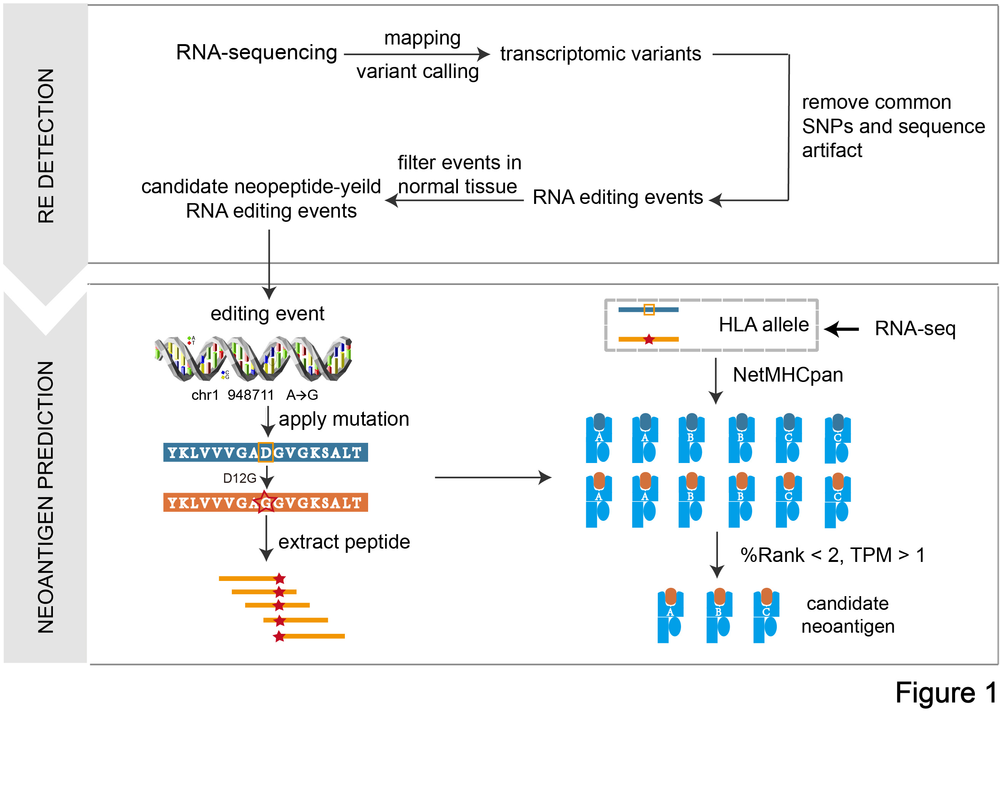

# PREP User Manual 

## Table of Contents
1. [General Description](#general-description)  
2. [Dependencies](#dependencies)  
    - [Required software](#required-software)  
    - [Python packages](#python-packages) 
3. [Installation via Docker](#installation-via-docker)  
4. [Installation from source](#installation-from-source)  
5. [Usage](#usage)  
6. [Input Files](#input-files)  
    - [Input Files (WES mode)](#input-files (required))  
    - [Input Files (VCF mode)](#input-files (optional))  
    - [References](#references)
7. [Setting parameters](#seting-parameters) 
8. [Output Files](#output-files)  
    - [Column explanation](#column-explanation)  
9. [Contact](#contact)
10. [Algorithmic Flow Chart](#algorithmic-flow-chart)

## General Description

RNA editing is a source of transcriptomic diversity, mainly in non-coding regions, and is altered in cancer. Recent studies demonstrated that A-to-I RNA editing events are manifested at the proteomic level and contribute to protein heterogeneity in cancer. Given somatic RNA-editing mutation as input, PREP identify and evaluate the potential immunogenicity of RNA editing based peptides. Detailed information please refer to citation.

## Dependencies  

#### Hardware:
PREP currently tested on x86_64 on ubuntu 16.04.

#### Required software:
* [Python 2.7](https://www.python.org/downloads/release/python-2712/)
* [NetMHCpan 4.0](http://www.cbs.dtu.dk/cgi-bin/nph-sw_request?netMHCpan)
* [Variant Effect Predictor (VEP)](https://github.com/Ensembl/ensembl-vep)
* [BWA](https://github.com/lh3/bwa)
* [STAR](https://github.com/alexdobin/STAR)
* [samtools](https://github.com/samtools)
* [Optitype](https://github.com/FRED-2/OptiType)
* [GATK 3.8](https://software.broadinstitute.org/gatk/best-practices/)
* [Picard tools](https://broadinstitute.github.io/picard/)
* [Java 8](https://java.com/en/download/help/linux_x64rpm_install.xml)
* [kallisto](http://pachterlab.github.io/kallisto/)
* [trimmomatic](http://www.usadellab.org/cms/?page=trimmomatic)
* [vcftools](http://vcftools.sourceforge.net/)
* [blast](http://ftp.ncbi.nlm.nih.gov/blast/executables/blast+/LATEST/)
* [tabix](http://www.htslib.org/doc/tabix.html)
* [gawk]()

#### Required Python package:
* [yaml](https://pypi.org/project/yaml-1.3/)
* [XGboost](https://pypi.org/project/xgboost/)
* [biopython](https://pypi.org/project/biopython/)
* [scikit-learn==0.19.1](https://pypi.org/project/scikit-learn/)
* [pandas](https://pypi.org/project/pandas/)
* [numpy](https://pypi.org/project/numpy/)
* [multiprocessing](https://pypi.org/project/multiprocessing/)
* [subprocess](https://pypi.org/project/subprocess/)
* [math](https://pypi.org/project/math/)
* [matplotlib](https://pypi.org/project/matplotlib/)

## Installation via Docker
Docker image of PREP is at https://hub.docker.com/r/bm2lab/prep/.

1. Install Docker on your computer and make sure it works.

2. Call docker `pull bm2lab/prep` which will download the Docker image.

3. Run the image in interactive mode with your dataset:
        
		docker run -it -v /your/path/to/dataset/:/home/bioworker/dataset bm2lab/prep /bin/bash

4. Change directory into /home/bioworker/project/PREP:

		cd /home/bioworker/project/PREP

5. Download reference data:

		bash data_download.sh

6. Edit `config.yaml` and fill the proper path of input files.

7. Run the program with follow commands:

		python PREP.py RE -i config.yaml

## Installation from source

1. Install all software, python packages and R packages listed above, and make sure each software and package works in your system. 
2. Install multiprocessing and other packages with the `pip` command:

        pip install -U multiprocessing
        ...
 
4. Download or clone the PREP repository to your local system:

        git clone https://github.com/bm2-lab/PREP.git

5. Reference data includes genome fasta, cDNA, peptide(GRCh38 build) could be downloaded and processed through:

        bash data_download.sh
        
    a few reference data would be in the fold `database` and processed by custom script in order to run the pipeline, including:

        [Fasta] 
	
        This fold contains the reference fasta file, its bwa index and some other files result from `huamn.fasta`:
        human.fasta	
        human.fasta.amb	
        human.fasta.ann	
        etc...
	
        [VCF_annotation] 
	
        This fold contains the vcf file and its index files used to run GATK best practice:
        dbsnp_138.hg38.vcf.gz
        1000G_phase1.snps.high_confidence.hg38.vcf.gz
        Mills_and_1000G_gold_standard.indels.hg38.vcf.gz
     
        [Protein] 
	
        This fold contains the reference cDNA and protein sequence of human:
        human.cdna.all.fa
        human.pep.all.fa

6. Among the required software listed above, BWA, GATK 3.8, kallisto, picard, samtools, tabix, trimmomatic-0.36, blast and  VarScan.v2.4.2 were prepared in software directory, other software should be installed by user own due to complexity, please refer to the software links above.

7. Fill in the `config.yaml` file with your local path, make sure you have installed all above software and have downloaded reference data.You should be aware that the version of VEP library you use should match the references used (peptide and cDNA). E.g. in the example above used version/release 89 of GRCh38.

## Usage

You can use these two modes by:

        python PREP.py RE -i config.yaml

## Input Files

### Input Files (WES mode) 
Pair-end matched tumor-normal whole exome sequencing file should be provided for basic neoepitopes identification, expression profile file or raw RNA sequencing file is optional if you want to get expressed neoepitope. iTunes accepts pair-end matched tumor-normal whole exome sequencing as input. It could be in `.fastq.gz` or `.fastq` format. 
You should specify the right path to the sequencing file in `config_WES.yaml` like:

    #your path to first tumor fastq file
    tumor_fastq_path_first: ~/ncbi/dbGaP-14145/sra/SRR2770550_1.fastq.gz
    #your path to second tumor fastq file
    tumor_fastq_path_second: ~/ncbi/dbGaP-14145/sra/SRR2770550_2.fastq.gz
    #your path to first normal fastq file
    normal_fastq_path_first: ~/ncbi/dbGaP-14145/sra/SRR2669057_1.fastq.gz
    #your path to second normal fastq file
    normal_fastq_path_second: ~/ncbi/dbGaP-14145/sra/SRR2669057_2.fastq.gz
    #your path to first RNA-seq fastq file
    tumor_rna_fastq_1: ~/ncbi/dbGaP-14145/sra/SRR2673065_1.fastq.gz
    #your path to second RNA-seq fastq file
    tumor_rna_fastq_2: ~/ncbi/dbGaP-14145/sra/SRR2673065_2.fastq.gz

### References 
The following references are required for iTunes to run:
* Reference DNA sequence and its annotation file. These files are used in somatic variant calling process.

        [Genome reference]
        human.fasta
        dbsnp_138.hg38.vcf.gz
        1000G_phase1.snps.high_confidence.hg38.vcf.gz
        Mills_and_1000G_gold_standard.indels.hg38.vcf.gz
        CosmicCodingMuts_chr_M_sorted.vcf.gz 
    
* Peptide and cDNA: The peptide reference is a FASTA file containing all peptides and all cDNA sequences of the human proteome.

        [cDNA and protein]
        Homo_sapiens.GRCh38.cdna.all.fa
        Homo_sapiens.GRCh38.pep.all.fa
        
* EnsemblVEP: VEP cache database (It should be emphasized that it is of very high importance that the references and VEP
match in release version (e.g. release-89)).

        [EnsemblVEP]
        homo_sapiens_vep_89_GRCh38.tar.gz

## Setting parameters
User should set all the parameters in the configuration file `config_WES.yaml` or `config_VCF.yaml`. The configuration file contains three parts of parameters:

* Input data parameters, including path of DNA/RNA sequencing data, output fold, run name, hla alleles, expression file and thread number (for WES mode).
(Note: user could specific hla allele throught `hla_str`, otherwise set it to `None`, the pipeline will make the prediction utilizing sequencing data. If RNA sequencing data is provided, please also set expression file to `None`.)
* Some filter parameter including mutation sequence depth, mutation variant allele fraction(vaf), binding affinity rank and expression FPKM.
* Software excutable path of opitype, vep, netMHCpan, PyClone and strelka.

## Output Files 
iTunes output four result files contain information of identified neoepitopes corresponding to nonsynonymous point mutation and INDEL mutation.

The output files are the following: 
1.  snv_neo_model.tsv 

    The file is a TSV file with the extracted mutated peptides derived from nonsynonymous point mutation with a model-based
    score measures the immunity of neoepitopes.
    
2.  indel_neo_model.tsv

    The file is a TSV file with the extracted mutated peptides derived from INDEL mutation with a model-based score measures
    the immunity of neoepitopes.

### Column explanation

The prediction output (snv_neo_model.tsv/indel_neo_model.tsv) for each peptide pair consists of the following columns:

| Column Name           | Description |
| -----------           | ----------- |
| Position              | Mutation position in genome. |
| HLA_type              | HLA allele name. |
| Gene                  | HUGO symbol name of mutatied gene. |
| WT_pep                | The extracted normal peptide. |
| WT_Binding_EL         | %Rank of prediction score for nomal peptides use NetMHCpan4.0 (defalut model). |
| WT_Binding_Rank       | %Rank of prediction score for nomal peptides use NetMHCpan4.0 (-ba model). |
| MT_pep                | The extracted mutant peptide. |
| MT_Binding_EL         | %Rank of prediction score for mutated peptides use NetMHCpan4.0(defalut model). |
| MT_Binding_Rank       | %Rank of prediction score for mutant peptides use NetMHCpan4.0 (-ba model). |
| Transcript_name       | Ensembl transcript ID |
| Mutation              | Necleotide change of mutated gene |
| AA_change             | Amino acid change annotated in VEP file. |
| Variant_allele_frequency  | Genomic allele frequency detected by MuTect2. |
| DriverGene_Lable      | TRUE if the HUGO symbol is in the cosmic reference list, FALSE if it is not. |
| MT_Binding_level_des  | Binding level description of mutated peptide. |
| WT_Binding_level_des  | Binding level description of normal peptide. |
| Homolog_pep           | The extracted homologous peptide of neo-peptide in human protein. |
| Homolog_Binding_EL    | %Rank of prediction score for homologous peptides use NetMHCpan4.0 (defalut model).|
| Recognition_score     | T cell recognition score calculated based on TCR cross reactivity. |
| Hydrophobicity_score  | Neo-peptide immunity mesurement based on animo acid hydrophobicity. |
| Self_sequence_similarity | Sequence similarity bewteen mutated peptide and normal(homglogous) peptide, We select the bigger one as final score |
| Model_pro       | Model prediction score (probability) for neoepitope recognized by T cell denpend on Recognition_score, Hydrophobicity_score, Self_sequence_similarity, WT_Binding_EL, MT_Binding_EL (calculated by Pre&RecNeo). |
| Immuno_effect_score	| Refined immunogenicty score for neoepitopes (calculated by RefinedNeo). |

## Contact   
 
1410782Chiz@tongji.edu.cn or qiliu@tongji.edu.cn

Biological and Medical Big data Mining Lab  
Tongji University    

## Algorithmic Flow Chart

